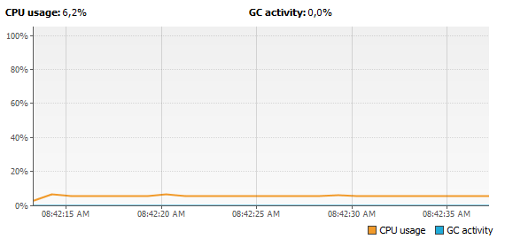

# Lab 4_ ARSW

En este laboratorio se trabajo la integración entre Heroku, GitHub, un framework web llamado Spark y por supuesto, Maven. Esto con el fin de implementar la aplicación trabajada en el laboratorio anterior pero en este caso web.	 

## Part l

Without any modification:

When I modified code:

